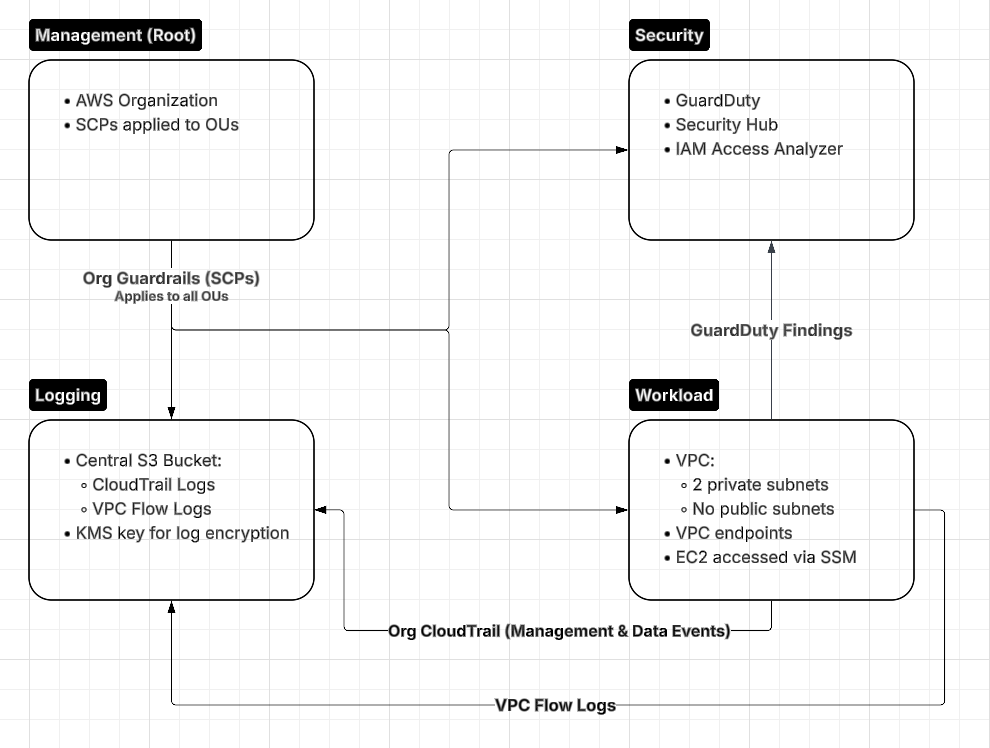

# AWS Secure Multi-Account Foundation

## Goal
Design and implement a secure AWS multi-account environment that enforces preventive guardrails and centralized detection using AWS native security services.

This project demonstrates how a cloud security engineer would design foundational controls to reduct blast radius, enforce least privilege, and maintain centralized visibility across AWS acounts.

## Architecture

## Security Controls

### Preventative Controls
- AWS Organizations with Service Control Policies (SCPs)
- Least-privilege IAM design
- No public subnets in workload accounts
- VPC endpoints for private AWS service access

### Detective Controls
- Organization-wide CloudTrail (management and data events)
- Centralized log storage in a dedicated logging account
- GuardDuty with delegated administrator model

## Design Principles
- Separation of duties between management, security, logging, and workloads
- Preventive controls enforced at the organization level
- Centralized visibility that cannot be disabled by workload accounts
- Secure-by-default infrastructure patterns

## Project Status
Architecture design completed. Infrastructure implementation will be completed using Terraform.
